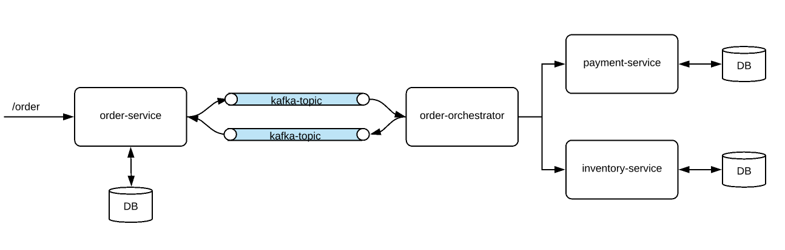

# SAGA-ORCHESTRATION-KAFKA

This project demonstrates how to implement Saga orchestration using Spring Boot and Kafka. Sagas are a way to manage distributed transactions across multiple microservices.

## Prerequisites

Before running this project, ensure you have the following installed:

- Java Development Kit (JDK) 17 or higher
- Docker

## Running Kafka Locally with Docker Compose

If you don't have Kafka installed locally, you can use Docker Compose to run Kafka easily:

1. Clone this repository:

   ```bash
   git clone https://github.com/Ismail-Ahrd/Saga-orchestration-kafka.git
   ```
2. Navigate to the root directory of the project
3. Run Docker Compose to start Kafka:
    ```bash
    docker compose up -d
    ```
## Overview of the project
Let's suppose that according to our business rule, when a user makes an order, the order will be completed if the price of the product falls within the user's credit limit or balance, and if there is sufficient inventory available for the product. If these conditions are not met, the order will not be completed.<br />
So we will have 3 Microservices with its own DB:
- order-service
- payment-service
- inventory-service

Applying the orchestration saga pattern involves employing an orchestrator,a separate service, which will be coordinating all the transactions among all the Microservices. If things are fine, it makes the order-request as complete, otherwise marks that as cancelled.<br />

In this demo, communication between orchestrator and other services would be a simple HTTP in a non-blocking asynchronous way. We can also use Kafka topics for this communication.<br />

